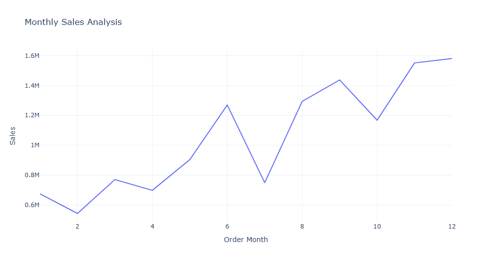
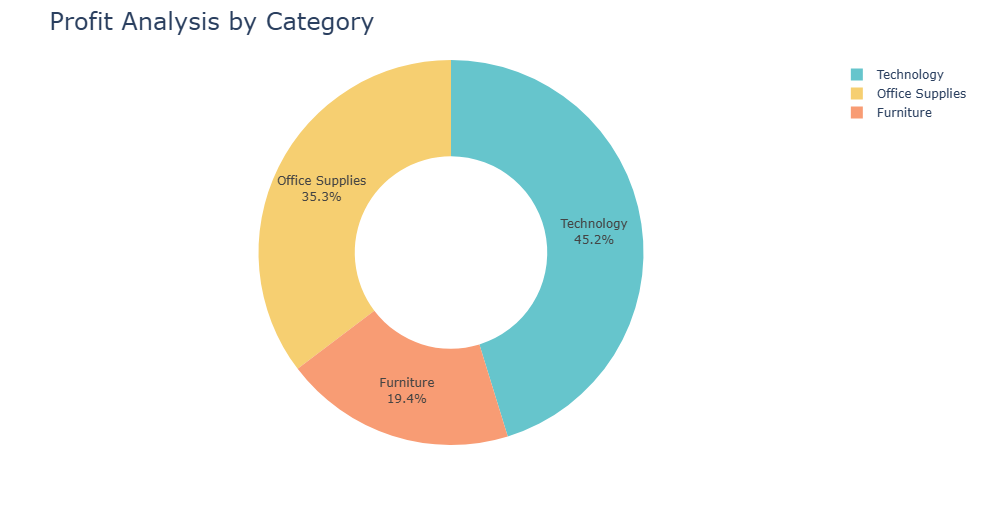
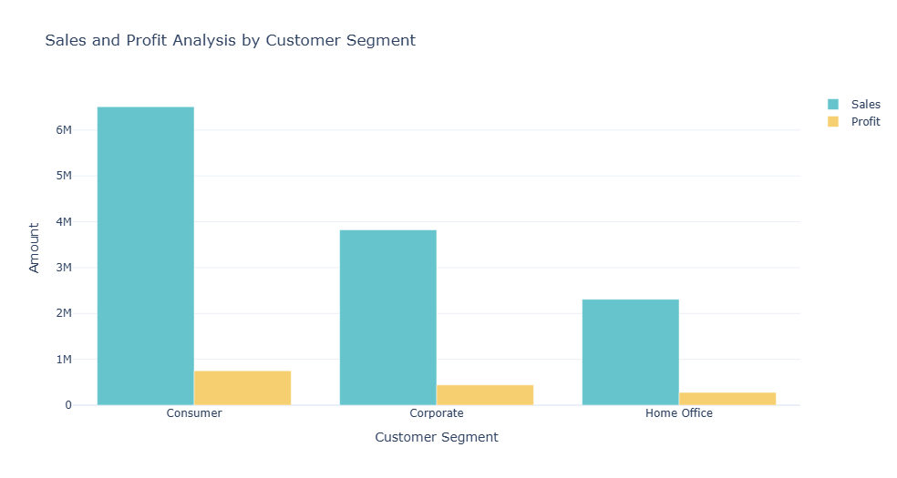

# Sales Data Analysis Project

## Goal
The purpose of this project is to analyze sales data to uncover patterns, identify best-selling items, and extract revenue indicators. The findings aim to support informed decision-making for enhancing business strategies.

---

## Objectives
1. **Compute Total Sales**  
   Determine the total revenue generated.
   
2. **Analyze Sales Trends Over Time**  
   Evaluate sales patterns by month, year, and day of the week.
   
3. **Identify Best-Selling Products**  
   Highlight products contributing most to revenue and visualize trends.

4. **Analyze Profitability**  
   Understand profit distribution across categories, sub-categories, and customer segments.

5. **Visualize Data**  
   Provide intuitive visual representations using charts and graphs.

---

## Dataset Overview
- **Number of Rows:** 51,290  
- **Number of Columns:** 24  
- **Key Columns:** `Order Date`, `Category`, `Sub-Category`, `Sales`, `Profit`, `Segment`

---

## Methodology and Steps
1. **Data Cleaning and Preprocessing**
   - Loaded the dataset and inspected its structure.
   - Extracted time-related features such as `Order Month`, `Order Year`, and `Order Day_of_week`.

2. **Monthly Sales Analysis**
   - Analyzed sales trends over time.
   - Visualized monthly and yearly sales trends.

3. **Sales and Profit Analysis by Category and Sub-Category**
   - Used pie charts and bar plots to show sales and profit distribution.

4. **Customer Segment Analysis**
   - Compared sales and profit by customer segments.
   - Calculated sales-to-profit ratios for better insights.

5. **Best-Selling Products**
   - Ranked products based on total sales.
   - Created bar charts to highlight top-performing products.

---

## Key Insights
1. **Sales Trends**
   - Sales peaked during specific months, showing seasonal patterns.
   - Certain days of the week consistently contributed more to sales.

2. **Profitability**
   - High sales do not always correlate with high profit. Certain categories showed better profit margins.

3. **Customer Segments**
   - Segment-specific strategies can optimize both sales and profit, as highlighted by sales-to-profit ratios.

4. **Top Performers**
   - Best-selling products were identified, helping focus on popular inventory.

---

## Visualizations
### Monthly Sales Analysis


### Profit Analysis by Category


### Sales and Profit by Customer Segment



## Additional Insights

This README provides an overview of the key findings and visualizations from the sales data analysis project. For a comprehensive exploration, the project includes detailed analyses such as:

- **Sales trends by day of the week and year**: Uncovering patterns in consumer behavior.
- **Profit distribution by sub-categories**: Identifying the most profitable product lines.
- **Monthly profit trends**: Evaluating performance over time.
- **Sales-to-profit ratio analysis**: Measuring efficiency and profitability across segments.

All additional analyses and corresponding visualizations are available in the [Project Notebook/Script File], offering a deeper dive into the data and insights derived during the study.


---

## Tools Used
- **Python**: For data manipulation and analysis.
- **Pandas**: To preprocess and aggregate data.
- **Plotly**: To create interactive and visually appealing graphs.
- **Jupyter Notebook**: For exploratory data analysis.

---

## Instructions
1. Clone the repository:
   ```bash
   git clone https://github.com/yourusername/sales-data-analysis.git
